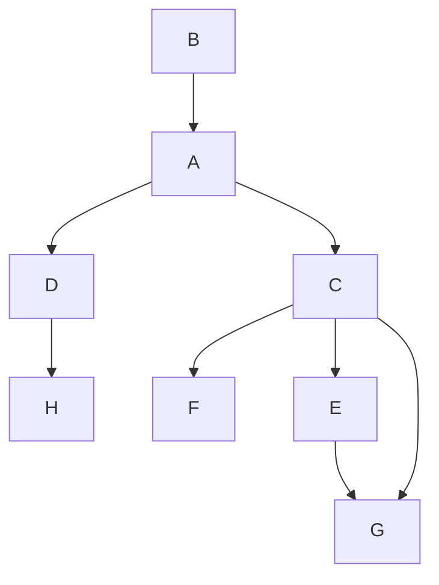

# Meta-Programming
# Build & Run
```sh
	make 
	make run
```

# Graph

Below graph is defined in file `include/logic.h`.


```mermaid
graph TD;
B-->A;
A-->C;
A-->D;
D-->H;
C-->F;
C-->E;
E-->G;
C-->G;
```
