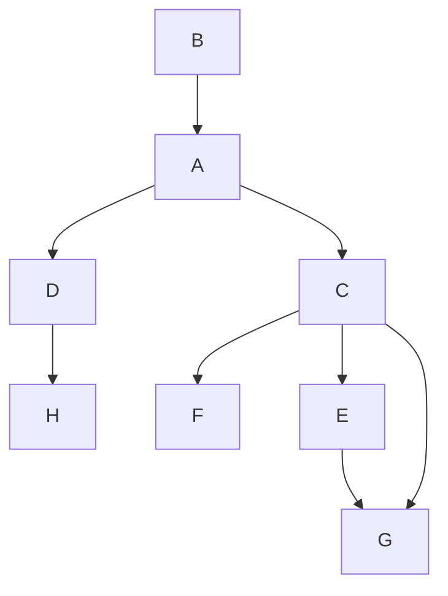

# Meta-Programming
# Build & Run
```sh
make 
make run
```

# Graph

Below graph is defined in file `include/logic.h`.



Excepted output:
```
DFS Result:
LogicA is running
LogicC is running
LogicE is running
LogicG is running
LogicF is running
LogicD is running
LogicH is running
LogicB is running
BFS Result:
LogicA is running
LogicC is running
LogicD is running
LogicE is running
LogicF is running
LogicG is running
LogicH is running
LogicB is running
```
